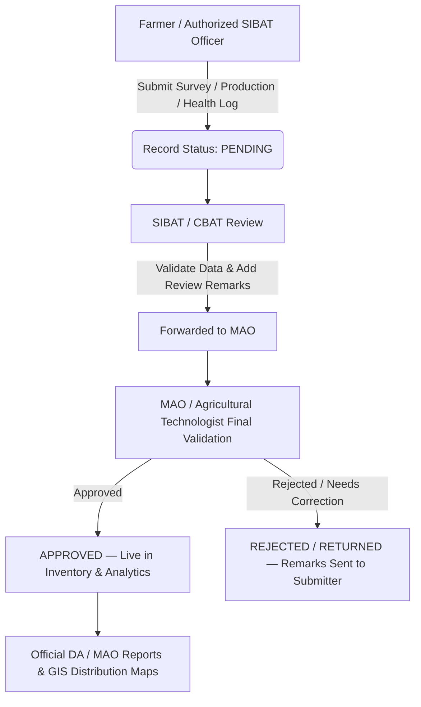

# 🐄 SmartLivestock-Batangas

> **Digital Livestock Surveillance, Production Tracking, and Municipal Agricultural Information System for Padre Garcia, Batangas.**

SmartLivestock-Batangas is a centralized, multi-role agricultural portal designed for the Municipal Agriculture Office (MAO), SIBAT/CBAT field officers, and livestock farmers of Padre Garcia — the "Cattle Trading Capital of the Philippines." 

It streamlines quarterly livestock census surveys, production logs (milk, meat, eggs), disease/mortality surveillance, and livestock inspection clearances into a verified data pipeline for official Department of Agriculture (DA) reporting and AI-assisted analytics.

---

## 🏗️ System Architecture & Workflow

The core architecture follows a 3-tier validation and review pipeline:



---

## 👥 Roles & Responsibilities Matrix

| System Actor | Confirmed Role & Authority | Primary Responsibilities |
|---|---|---|
| **👨‍🌾 Farmer** | Operational Data Provider | Manage personal livestock inventory, log daily/monthly milk & egg production, submit mortality & health alerts, view validation remarks. |
| **👥 SIBAT / CBAT** | Field Validator & Census Encoder | Encode quarterly census records, assist farmers with data entry, review & attach notes to submissions, forward to MAO. *(No final approval authority)*. |
| **🏛️ MAO / Technologist** | Final Authority & Registry Admin | Final validation & approval/rejection of census and production records, disease surveillance management, official DA report exports. |
| **🩺 Livestock Inspector / Auction** | Inspection & Clearance *(In Verification)* | Enter livestock inspection items, verify animal health clearances at auction markets. |
| **🥩 Slaughterhouse Staff** | Meat & Carcass Records *(In Verification)* | Record carcass weight, post-mortem inspections, and commercial meat tracking. |

---

## 🛠️ Technology Stack

### Backend
* **Framework:** Django 5.x & Django REST Framework (DRF)
* **Authentication:** JWT (JSON Web Tokens) with custom `AbstractUser` and RBAC roles
* **Database:** PostgreSQL (Production) / SQLite (Development)
* **Environment & Package Management:** Pipenv (`Pipfile`)

### Frontend
* **Framework:** Next.js 16 (App Router with Turbopack) & React 19
* **Language:** TypeScript
* **State & Server Cache:** TanStack React Query v5
* **Styling:** Tailwind CSS & Lucide Icons / `@lucide/lab`
* **Data Visualization:** Recharts
* **UI Components:** Radix UI / Shadcn UI & Sonner

---

## 🗺️ Project Milestones & Roadmap (Aligned with Notion)

### 🔴 Phase 01: Core Backend CRUD
- [x] Custom User model & JWT authentication
- [x] Farmer profile creation & relationship mapping
- [x] Barangay listing endpoint (`GET /livestock/barangays/`) with GIS coordinates
- [x] Barangay-filtered Farmer options endpoint (`GET /livestock/farmers/<int:barangay_id>/`)
- [x] Livestock Inventory CRUD (`/livestock/inventory/`)
- [x] Production Records CRUD with cancel/update APIs (`/production/`)
- [x] Quarterly Census Submission API with nested items (`POST /livestock/create_submission/`)
- [x] Database Seeding management command (`python manage.py seed_farmers` with `--clean` rollback)
- [ ] Role-based permission classes (RBAC) across all endpoints
- [ ] Backend test suite (Auth, Inventory, Production)

### 🟠 Phase 02: Validation & Review Workflow
- [x] SIBAT vs MAO role authority definitions
- [ ] Pending submission endpoints for SIBAT & MAO queues
- [ ] SIBAT review action with remarks and forwarding
- [ ] MAO final approval & rejection actions
- [ ] Status change locks (prevent farmers from modifying approved entries)
- [ ] End-to-end multi-role validation tests

### 🟡 Phase 03: Farmer & SIBAT Frontend Portals
- [x] Reusable `<KpiCard>` UI component with animated status bars and skeletons
- [x] Farmer Dashboard metrics, herd distribution charts & milk production trends
- [x] Production Dashboard with multi-step creation wizard & history log
- [x] Livestock Inventory management with search, filters, and batch entry
- [x] SIBAT Quarterly Census Submission Dialog with reactive Barangay/Farmer select
- [ ] Real-time notification badge and alerts inbox

### 🟢 Phase 04: Disease & Mortality Surveillance
- [x] Disease and Mortality database models
- [ ] Disease Case serializers & CRUD endpoints (`/diseases/`)
- [ ] Farmer health observation submission modal & veterinary notification
- [ ] Mortality relationship linking to specific livestock tags

### 🔵 Phase 05: Livestock Inspection & Movement
- [x] Livestock Inspection, Items, and Clearance database models
- [ ] Auction inspection entry forms & printable inspection clearances
- [ ] Stakeholder workflow alignment for auction house and slaughterhouse

### 📊 Phase 06–12: Advanced Features & Capstone Modules
- [ ] **NLP / NLG:** Grounded natural language narrative generation for monthly summaries
- [ ] **Analytics & DA Reports:** Official Excel & PDF report generation for MAO/DA submissions
- [ ] **GIS Mapping:** Interactive herd distribution and disease quarantine zoning for Padre Garcia
- [ ] **AI Assistant:** Natural language assistant for livestock queries and inventory totals

---

## 📁 Repository Structure

```text
SmartLivestock/
├── backend/
│   ├── livestock/                 # Inventory, Barangays, Census Submissions & Seeder
│   │   ├── management/commands/   # Django management commands (seed_farmers.py)
│   │   ├── models.py              # Barangay, Farmer, Livestock, Census models
│   │   ├── serializer.py          # DRF Serializers
│   │   ├── urls.py                # API endpoints
│   │   └── views/                 # View controllers (inventory, census)
│   ├── production/                # Milk, egg, slaughter, and sales records
│   ├── users/                     # Custom User, Role, and Profile models
│   ├── movements/                 # Inspections, clearances, and meat movement
│   ├── diseases/                  # Disease cases and mortality logs
│   └── smartlivestock/            # Core Django settings & root routing
│
├── frontend/
│   ├── src/
│   │   ├── app/
│   │   │   ├── (farmer)/          # Farmer dashboard, inventory & production logger
│   │   │   ├── (sibat)/           # SIBAT census submission & validation queue
│   │   │   ├── (admin)/           # MAO / LGU admin overview & report exports
│   │   │   ├── (auction)/         # Livestock inspections & clearances
│   │   │   └── components/        # Shared header, sidebar, KPI cards & AI search
│   │   ├── components/ui/         # Shadcn base primitives
│   │   └── lib/                   # Axios client & shared utilities
│   └── package.json
└── README.md
```

---

## ⚡ Getting Started

### 1. Backend Setup

```bash
cd backend

# Install dependencies using pipenv
pipenv install

# Activate virtual environment
pipenv shell

# Apply database migrations
python manage.py migrate

# Seed test data for 17 Padre Garcia barangays & 98 farmer accounts
python manage.py seed_farmers

# (Optional: Revert seed data anytime)
# python manage.py seed_farmers --clean

# Start Django development server
python manage.py runserver
```

> **Default Seed Accounts:**
> * All generated farmer accounts use emails matching `<firstname>.<lastname>@smartlivestock.ph`
> * Default password: `Password123!`

### 2. Frontend Setup

```bash
cd frontend

# Install npm dependencies
npm install

# Start Next.js development server
npm run dev

# Run build verification
npm run build
```

Open [http://localhost:3000](http://localhost:3000) in your browser.

---

## 📋 Confirmed Stakeholder Data Sources

| Data Source | Primary Source | Status |
|---|---|---|
| **Livestock Inventory** | Farmers | Confirmed |
| **Production Records** | Farmers | Confirmed |
| **Quarterly Livestock Census** | SIBAT / CBAT | Confirmed |
| **Farmer Registry** | MAO / Agricultural Technologist | Confirmed |
| **Disease Reports** | MAO / Agricultural Technologist | Confirmed |
| **Mortality Reports** | Farmers $\rightarrow$ MAO | Confirmed |
| **Negative Disease Monitoring** | MAO | Confirmed |
| **Rabies Vaccination Reports** | MAO | Confirmed |
| **Livestock Inspection** | MAO / Livestock Inspector | Confirmed |
| **Livestock Inspection Clearance** | MAO | Confirmed |
| **Slaughter Records** | Slaughterhouse | *Pending Stakeholder Interview* |
| **Meat Movement** | Slaughterhouse | *Pending Stakeholder Interview* |
| **Auction Transactions** | Auction Market | *Pending Stakeholder Interview* |

---

## 💡 Project Philosophy

This project follows a project-driven, modular architecture:
1. Solidify the core data models and relational integrity.
2. Build verified RESTful APIs and clean validation boundaries.
3. Connect dynamic Next.js portals with type-safe state and responsive caching.
4. Scale into reporting, GIS visualization, and AI-assisted agricultural insights.
